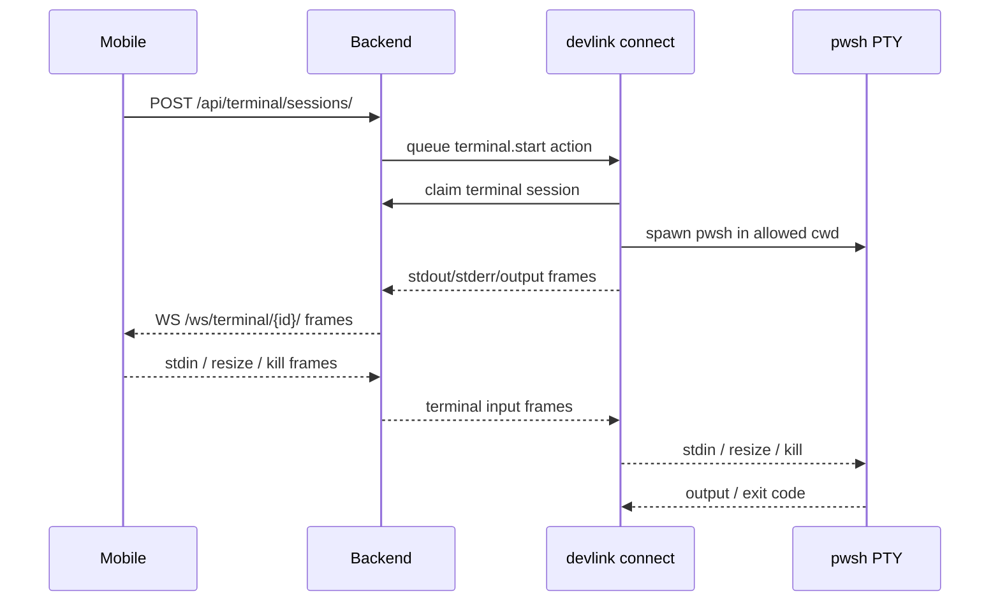

# DevLink Mobile pwsh Terminal Plan

## Goal

Add a predictable terminal expirience to DevLink without letting the phone run local commands directly. Mobile opens and controls a terminal session, the backend routes session state and authorization, and the paired `devlink connect` process owns the local `pwsh` process.

## UX

- Entry points:
  - MVP: `Codex Hub -> Debug -> Terminal`.
  - Later: workspace action menu, command palette, and run-log command follow-up.
- Mobile layout:
  - Full-screen sheet with a compact toolbar.
  - Toolbar shows current workspace, `cwd`, connection state, reconnect, kill, and close.
  - Terminal body uses monospace text, selection-friendly output, and a sticky input row for comands if a native terminal renderer is not ready.
- Tablet/desktop layout:
  - Split panel or fullscreen modal from the Hub.
  - Same session controls as mobile, with resize support.
- Session states:
  - `starting`, `connected`, `reconnecting`, `exited`, `killed`, `failed`.
  - Reconnect should backfill buffered output from the backend by sequence.

## Architecture

The backend does not spawn `pwsh`. It manages ownership, device routing, session records, buffering, and WebSocket fanout. The paired CLI bridge starts the local proces because it is the only component with access to the laptop filesystem.

## Proposed API

- `POST /api/terminal/sessions/`
  - Body: `project_id`, optional `cwd`, optional `shell: "pwsh"`.
  - Creates a terminal session and queues work for the paired CLI.
- `GET /api/terminal/sessions/{id}/`
  - Returns state, cwd, device, project, started/exited timestamps, and exit code.
- `POST /api/terminal/sessions/{id}/kill/`
  - Requests process termination.
- `WS /ws/terminal/{id}/`
  - Server to mobile: `ready`, `output`, `stderr`, `cwd`, `resize.ack`, `exit`, `error`.
  - Mobile to server: `stdin`, `resize`, `kill`, `ping`.

The CLI can use the existing polling/action channel for MVP, or a dedicated terminal bridge channel later if latency needs it.

## Windows pwsh Target

- Spawn command: `pwsh`.
- Initial cwd:
  - Default to the active registered project path.
  - Allow subdirectories inside that project.
  - Reject cwd outside registered project/add-dir scopes unless an approval flow explicitly allows it.
- Environment:
  - Inherit safe user environment from the CLI process.
  - Do not inject mobile auth tokens into the shell environment.
- Exit handling:
  - Capture `exit_code`, `finished_at`, and final cwd when possible.

## Streaming Details

- `stdin`: mobile sends raw input frames to backend, backend routes to owning CLI, CLI writes to PTY stdin.
- `stdout`/`stderr`: CLI streams frames with monotonic `sequence`, timestamp, stream name, and bytes/text payload.
- `resize`: mobile sends columns/rows on layout changes; CLI calls PTY resize.
- `cwd`: CLI should emit cwd updates after prompt detection if feasible. MVP can update cwd only when session starts or when explicit `cd` wrappers are added later.
- Backfill: backend stores recent terminal frames per session so reconnecting mobile clients can request `after_sequence`.

## Security

- Scope:
  - Terminal start is allowed only for registered projects and approved additional directories.
  - Backend validates user owns project, device, and terminal session.
- Approvals:
  - Starting inside normal workspace can be safe.
  - Starting outside workspace, elevated shell modes, or dangerous device scopes requires approval.
  - Destructive command detection is unreliable inside an interactive shell, so the stronger control is directory scope plus explicit terminal start approval for risky scopes.
- Limits:
  - Max sessions per user/device.
  - Idle timeout.
  - Hard max lifetime.
  - Output buffer limits with truncation markers.
- Cleanup:
  - Kill PTY when mobile closes with `kill`.
  - Keep process alive during short reconnects.
  - CLI kills orphaned PTYs on bridge shutdown.
- Audit:
  - Record session start/stop, cwd, device, project, exit code, and coarse command input frames where policy allows.

## MVP

1. Add terminal plan and UX entry point placeholder in Hub Debug.
2. Backend terminal session model/API with ownership and queued start action.
3. CLI bridge starts `pwsh` with PTY in registered project cwd.
4. Stream stdout/stderr to mobile over WebSocket with sequence numbers.
5. Add stdin and kill support.
6. Add resize and reconnect backfill.
7. Harden approvals, limits, cleanup, and audit logs.

## Risks

- PTY support differs between Windows and Unix, so Windows `pwsh` should be the first target and tested on the user's actual environment.
- Mobile text input for a terminal can be awkward; command history, paste handling, and special keys need deliberate UI.
- Output volume can overwhelm mobile rendering; frame batching and truncation are required.
- Interactive shells can run destructive commands, so scope and session-level permissions matter more than trying to parse every command.

## Later Extensions

- Multiple tabs per workspace.
- Attach terminal output to a Codex run.
- Share cwd with Composer file mentions.
- Command snippets for common project scripts.
- Optional native terminal renderer after MVP proves the bridge.
